<div align="center">

<!-- Sci-Fi Animated Header -->


<br/>

<!-- Animated Tic-Tac-Toe: Two AI Bots Battle -->


<br/>

<!-- Typing SVG -->
<a href="https://git.io/typing-svg"></a>

</div>

---

## `> whoami`

```
nagendhra@ai:~$ cat /etc/profile
```

AI Engineer with **4+ years** building enterprise-grade generative AI systems, retrieval-augmented generation pipelines, and agentic architectures. I ship production systems that serve thousands of users — not just prototypes.

- Previously **Data Engineer at Goldman Sachs**, where I validated 57M+ financial records with zero incidents
- **MS in Information Science (AI & Data Analytics)** from University at Albany, SUNY — GPA: 3.70/4.0
- Currently building **agentic RAG systems** and **open-source developer tools** in NYC

---

## `> cat /proc/openclaw/status`

<div align="center">

<table>
<tr>
<td width="80" align="center">

</td>
<td>

### OpenClaw — Code Intelligence Without LLMs

**What:** An open-source code intelligence engine that understands your codebase through pure **AST parsing**, **static analysis**, **pattern matching**, and **rule engines** — no LLM calls, no token costs, no API latency.

**Why:** LLMs are powerful but expensive, slow, and non-deterministic. OpenClaw provides fast, predictable, and private code understanding that runs entirely on your machine.

**How:** Abstract syntax trees + control flow graphs + type inference + semantic pattern matching = deep code understanding at the speed of your local CPU.

</td>
</tr>
</table>

```
[ ] AST Parser Engine        [===========--------]  60%
[ ] Static Analysis Core     [=========-----------]  45%
[ ] Pattern Matching DSL     [=======-------------]  35%
[ ] Rule Engine              [=====---------------]  25%
[ ] VS Code Extension        [====-----------------] 20%
```

</div>

---

## `> ls -la /skills/`

<div align="center">

### AI & LLM


### ML & Data Science


### Languages


### Cloud & Infrastructure


### Data & Pipelines


### Frameworks & Tools


</div>

---

## `> ls /projects/featured/`

<div align="center">

<table>
<tr>
<td width="50%" valign="top">

### [`memory-bank`](https://github.com/Nagendhra-web/memory-bank)
**Persistent Memory for AI Coding Tools**


Branch-aware embeddings + ChromaDB vector storage. Cuts token usage by **60-80%** per session. Extends context retention across the full AI lifecycle.

</td>
<td width="50%" valign="top">

### [`Immortal`](https://github.com/Nagendhra-web/Immortal)
**Self-Healing AI Runtime Engine**


Detects failures, traces root causes across cascading crashes, auto-recovers production systems. **58 Go packages**, 3 SDKs, single binary.

</td>
</tr>
<tr>
<td width="50%" valign="top">

### [`jobsheet.me`](https://github.com/Nagendhra-web/jobsheet.me)
**Agentic RAG Job Intelligence Platform**


Aggregates roles from **17K+ company** career pages with autonomous LangGraph agents. Real-time job discovery for thousands of users.

</td>
<td width="50%" valign="top">

### [`pulseops`](https://github.com/Nagendhra-web/pulseops)
**Real-Time Financial Analytics & Anomaly Detection**


Ingests product events, models KPIs, detects anomalies with ML scoring. Kafka + DuckDB + dbt + scikit-learn pipeline.

</td>
</tr>
</table>

</div>

---

## `> cat /metrics/github`

<div align="center">


<br/>


</div>

---

## `> cat /metrics/activity`

<div align="center">


</div>

---

## `> cat /etc/experience`

```
+---------------------------+-----------------------------+-----------------+
|         ROLE              |        COMPANY              |     PERIOD      |
+---------------------------+-----------------------------+-----------------+
| AI Systems Engineer       | Self-Employed (NYC)         | Jan 2026 - Now  |
| Graduate Research Asst.   | University at Albany (SUNY) | Mar - Dec 2025  |
| Data Engineer             | Goldman Sachs (Hyderabad)   | Jan 2022 - 2023 |
+---------------------------+-----------------------------+-----------------+
```

---

## `> cat /etc/certifications`

<div align="center">


</div>

---

## `> netstat -connect`

<div align="center">

[](https://www.linkedin.com/in/nagendhramadishetti)
[](mailto:nagendhra.madishetti24@gmail.com)
[](https://github.com/Nagendhra-web)
[](https://jobsheet.me)

</div>

---

<div align="center">

### Profile Views


<br/>

```
// The best code is the one that solves real problems.
// Ship it. Measure it. Improve it.
```


</div>
